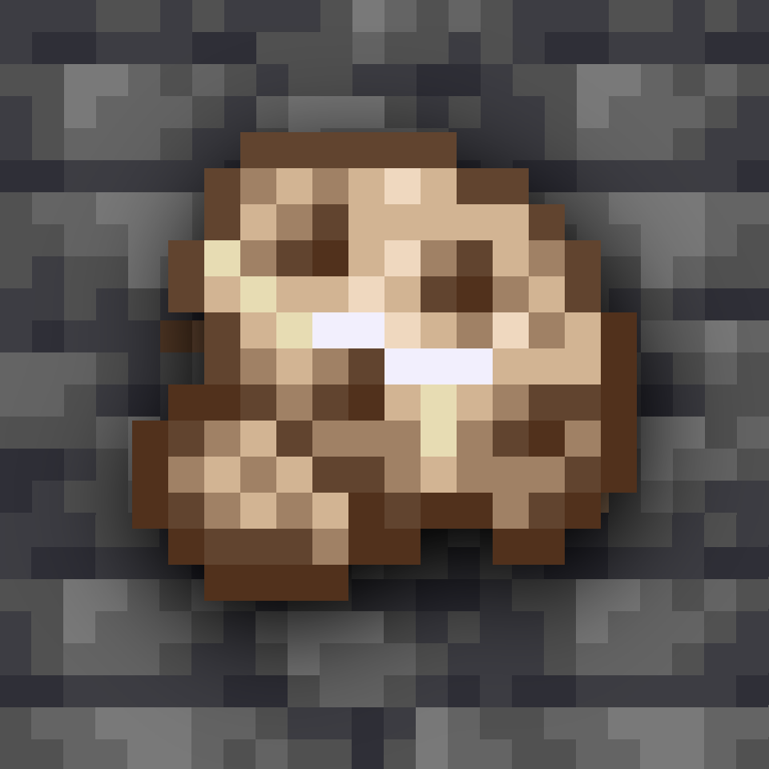
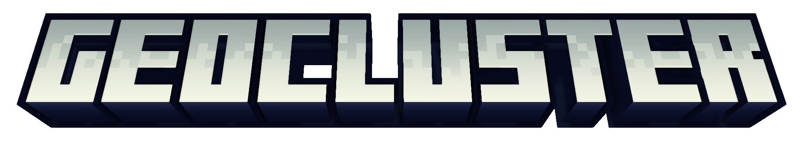

<div align="center">

   
   



<!-- todo: replace 494721 with your CurseForge project id -->
[][releases]
[][curseforge]
[][curseforge:files]
</div>

It is built on the [Fabric][fabric]/[Quilt][quilt] mod loader and is available for modern
versions of [Minecraft][minecraft] Java Edition.

## Disable other mods ore generation
Add the placed feature of the mods ore you want to disable in the tag:
``data/geocluster/tags/worldgen/placed_feature/ores_to_remove.json``
Remember to check if there is more than one feature for an ore. For example, gold has 4 overworld features and one nether feature:
```json5
...
"ore_gold_deltas",
"ore_gold_extra",
"ore_gold_lower",
"ore_gold_nether",
"ore_gold",
...
```


## Add or modify ore clusters
The mod comes with a few ore clusters, which should be changed to reflect your packs theme. To modify the default clusters, just add a json with the same name in
the ``data/geocluster/deposits/`` as the cluster you want to change. If you want to remove the cluster entirely, just leave a blank ``{}`` in the json.

If you want to add new clusters a practical solution is more appropriate, there is 5 different clusters you have to choose from.
* deposit_dense
* deposit_dike
* deposit_sparse
* deposit_layer
* deposit_top_layer

### <span style="color:pink">deposit_dense</span>
```json5
{                                                      /* Notes / Comments    ↓                                    */
  "type": "geocluster:deposit_dense",                  /* This tells Geocluster how to generate this cluster       */
  "config": {
    "yMin": 5,                                         /* The Minimum Y-level the deposit can gen                  */
    "yMax": 30,                                        /* The Maximum Y-level the deposit can gen                  */
    "size": 40,                                        /* The Maximum dx/dy/dz from the center of the cluster      */
    "biomeTag": "#is_overworld",                       /* The biome tag you wish to generate this deposit in       */
    "blockStateMatchers": [ "minecraft:stone" ],       /* The blocks you want this deposit to be able to replace   */
    "blocks": {                                        /* List of blocks to use within this cluster. null = skip   */
      "default": [{                                    /* Blocks now MUST have a "default"                         */
        "block": "gold_ore",
        "chance": 1.0
      }],
      "minecraft:deepslate": [{                        /* This says "if you replace deepslate use this ore instead */
        "block": "deepslate_gold_ore",
        "chance": 1.0
      }]
    },
    "samples": [{                                      /* List of samples to use within this cluster. null = skip  */
      "block": "geocluster:ancient_debris_ore_sample", 
      "chance": 1.0
    }],
    "generationWeight": 1                              /* The weight for this specific cluster to generate         */
  }
}
```

### <span style="color:pink">deposit_dike</span>
```json5
{                                                      /* Notes / Comments    ↓                                    */
  "type": "geocluster:deposit_dike",                   /* This tells Geocluster how to generate this cluster       */
  "config": {
    "yMin": 8,                                         /* The Minimum Y-level the deposit can gen                  */
    "yMax": 22,                                        /* The Maximum Y-level the deposit can gen                  */
    "maxHeight": 8,                                    /* The Maximum height of the dike spike                     */
    "baseRadius": 3,                                   /* The Base radius of the deposit when the dike is formed   */
    "biomeTag": "#minecraft:is_nether",                /* The biome tag you wish to generate this deposit in       */
    "blockStateMatchers": [ "minecraft:netherrack" ],  /* The blocks you want this deposit to be able to replace   */
    "blocks": {                                        /* List of blocks to use within this cluster. null = skip   */
      "default": [{                                    /* Blocks now MUST have a "default"                         */
        "block": "geocluster:tin_ore",
        "chance": 0.9
      }, {
        "block": null,
        "chance": 0.1
      }],
      "minecraft:netherrack": [{                       /* This says "if you replace netherrack use this ore instead*/
        "block": "nether_gold_ore",
        "chance": 1.0
      }]
    },
    "samples": [{                                      /* List of samples to use within this cluster. null = skip  */
      "block": "geocluster:gold_ore_sample",           
      "chance": 1.0
    }],
    "generationWeight": 1                              /* The weight for this specific cluster to generate         */
  }
}
```

### <span style="color:pink">deposit_sparse</span>
```json5
{                                                      /* Notes / Comments    ↓                                    */
  "type": "geocluster:deposit_sparse",                 /* This tells Geocluster how to generate this cluster       */
  "config": {
    "yMin": 16,                                        /* The Minimum Y-level the deposit can gen                  */
    "yMax": 50,                                        /* The Maximum Y-level the deposit can gen                  */
    "size": 32,                                        /* Tweaks size similar to a Dense deposit                   */
    "spread": 32,                                      /* Gens a dense deposit then adds rnad(spread) to each block*/
    "biomeTag": "#c:is_dry/overworld",                 /* The biome tag you wish to generate this deposit in       */
    "blockStateMatchers": [ "minecraft:stone" ],       /* The blocks you want this deposit to be able to replace   */
    "blocks": {                                        /* List of blocks to use within this cluster. null = skip   */
      "default": [{                                    /* Blocks now MUST have a "default"                         */
        "block": "geocluster:lead_ore",
        "chance": 1.0
      }],
      "minecraft:deepslate": [{                        /* This says "if you replace deepslate use this ore instead */
        "block": "geocluster:deepslate_lead_ore",
        "chance": 1.0
      }]
    },
    "samples": [{                                      /* List of samples to use within this cluster. null = skip  */
      "block": "geocluster:lead_ore_sample",           
      "chance": 1.0
    }],
    "generationWeight": 1                              /* The weight for this specific cluster to generate         */
  }
}
```

### <span style="color:pink">deposit_layer</span>
```json5
{                                                      /* Notes / Comments    ↓                                    */
  "type": "geocluster:deposit_layer",                  /* This tells Geocluster how to generate this cluster       */
  "config": {
    "yMin": 40,                                        /* The Minimum Y-level the deposit can gen                  */
    "yMax": 70,                                        /* The Maximum Y-level the deposit can gen                  */
    "radius": 3,                                       /* The radius of the layer (noise is added)                 */
    "depth": 4,                                        /* The height of the layer deposit                          */
    "biomeTag": "#geocluster:is_sandy",                /* The biome tag you wish to generate this deposit in       */
    "blockStateMatchers": [ "minecraft:stone" ],       /* The blocks you want this deposit to be able to replace   */
    "blocks": {                                        /* List of blocks to use within this cluster. null = skip   */
      "default": [{                                    /* Blocks now MUST have a "default"                         */
        "block": "coal_ore",
        "chance": 1.0
      }],
      "minecraft:deepslate": [{                        /* This says "if you replace deepslate use this ore instead */
        "block": "deepslate_coal_ore",
        "chance": 1.0
      }]
    },
    "samples": [{                                      /* List of samples to use within this cluster. null = skip  */
      "block": "geocluster:coal_ore_sample",     
      "chance": 1.0
    }],
    "generationWeight": 1                              /* The weight for this specific cluster to generate         */
  }
}
```

### <span style="color:pink">deposit_top_layer</span>
```json5
{                                                      /* Notes / Comments    ↓                                    */
  "type": "geocluster:top_deposit_layer",              /* This tells Geocluster how to generate this cluster       */
  "config": {                                          /* YMIN/MAX IS NOT PERMITTED BC. USE LAYER IF YOU NEED IT   */
    "radius": 4,                                       /* The radius of the layer (noise is added)                 */
    "depth": 4,                                        /* The height of the layer deposit                          */
    "chanceForSample": 0.25,                           /* The chance for a sample block to be generated            */
    "biomeTag": "#is_mountain",                        /* The biome tag you wish to generate this deposit in       */
    "blockStateMatchers": [ "minecraft:dirt" ],        /* The blocks you want this deposit to be able to replace   */
    "blocks": {                                        /* List of blocks to use within this cluster. null = skip   */
      "default": [{                                    /* Blocks now MUST have a "default"                         */
        "block": "red_sand",
        "chance": 1.0
      }],
      "minecraft:dirt": [{                             /* This says "if you replace dirt use this ore instead      */
        "block": "red_sand",
        "chance": 1.0
      }]
    },
    "samples": [{                                      /* List of samples to use within this cluster. null = skip  */
      "block": "allium",                               
      "chance": 1.0
    }],
    "generationWeight": 1                              /* The weight for this specific cluster to generate         */
  }
}
```

[curseforge]: https://curseforge.com/minecraft/mc-mods/geocluster/files
[curseforge:files]: https://curseforge.com/minecraft/mc-mods/geocluster/files
[quilt]: https://quiltmc.org/
[fabric]: https://fabricmc.net/
[minecraft]: https://minecraft.net/
[releases]: https://github.com/mrsterner/Geocluster/releases
[mrsterner]: https://github.com/mrsterner